# Design and Architecture of _Chirp!_

## Domain model
Our domain model consists of two main elements, and one for infrastructure purposes:
- User

A 'User' is an entity who can write new Cheeps, and follow other Users. The relation from one user to another user describes a one-to-many relation, where one user can have many followers.
- Cheep

The 'Cheep' entity is the posts in the Chirp application. An author can write many Cheeps, which explains the one-to-many relation.
- Follow

The 'Follow' table keeps track of which users follow who, which can both be linked through UserId's, or an entity of a User class.

Below is a diagram visualizing the relations between our different entities.

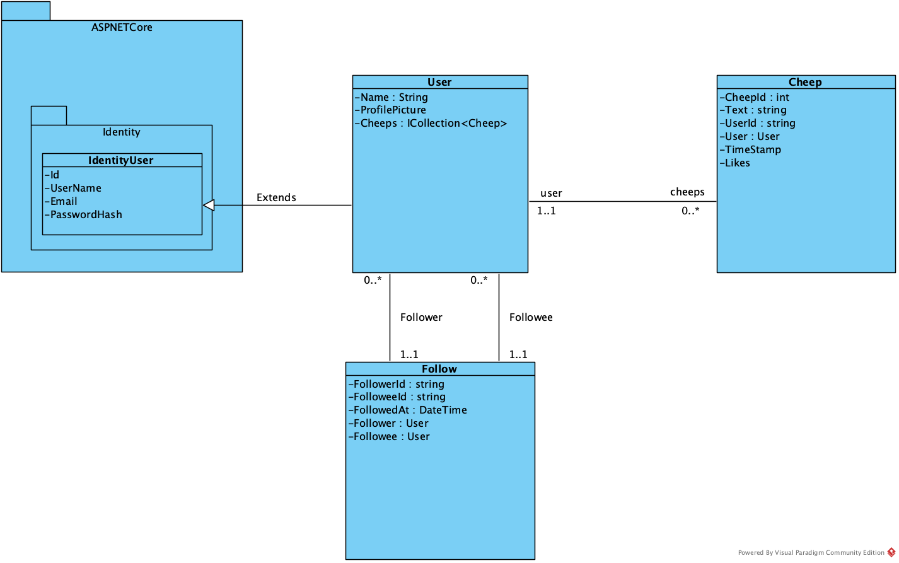

## Architecture — In the small
Our project follows the principles in Onion Architecture, where the presentation, the infrastructure and the domain are separated into layers. This minimalizes coupling and supports maintainability as well as testability. 

The presentation happens in the Web layer, which handles application startup as well as user interaction.

The Infrastructure layer acts as an intermediary between User Interface and the core logic. Managing data persistence, repositories as well as database migrations among other things.

The Domain layer is completely independent, since the dependencies are directed inward. This ensures that the core logic is not affected by things happening in the infrastructure layer. 
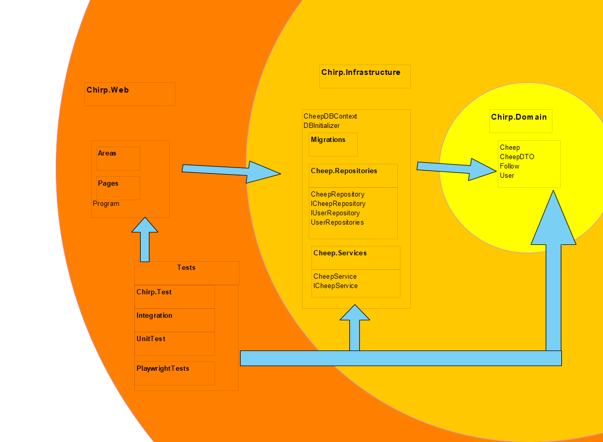

## Architecture of deployed application
Users send HTTPS requests from their browser (the client) to our application hosted on Azure. Azure runs our ASP.NET Core server, which processes request using Razor Pages. The server accesses data from a SQLite database via Entity Framework Core and handles user authentication with ASP.NET Core Identity.

 

## User activities
A user activity diagram showing what an unauthorized user can do and how they become authorized. 

A user activity diagram showing the actions available to an authorized user, such as managing their account, posting cheeps or following other users.   

A user activity diagram showing the entire process of an unauthorized user becoming authorized and how they can interact with Chirp!
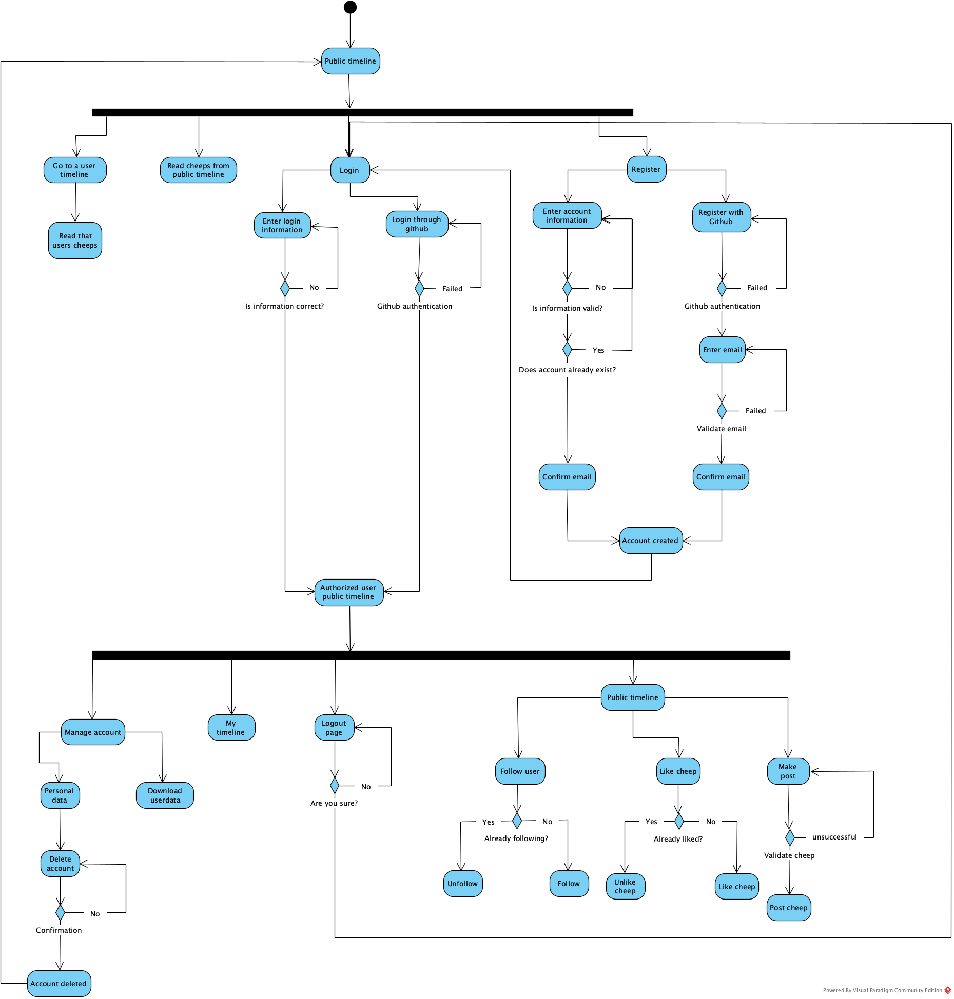

## Sequence of functionality/calls through _Chirp!_
This illustrates the flow of messages and data sent through our Chirp application. It is illustrated for an unauthorized user sending an HTTP request to root endpoint, and ending up with a completely rendered web-page returned to the user.
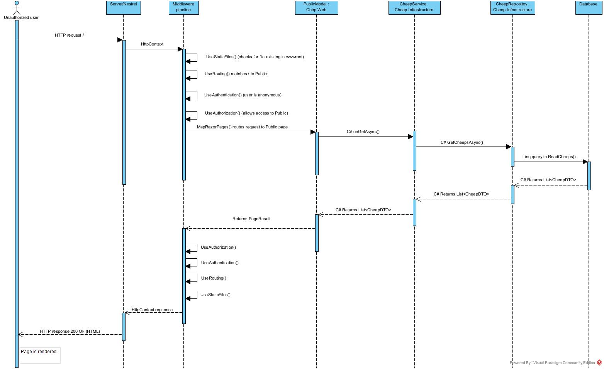

Small comments on the middleware pipeline:  
Requests also go through the middlewares
UseExceptionHandler(),
UseHsts(),
UseHttpsRedirection(),
When the app is not in development

We have chosen to show the process of going through middlewares as self-messages.

The middleware pipeline and Server/Kestrel lifeline is added as lifelines to completely show how the request is handled in ASP.NET (see figure 3.1 p. 32 ASP.NET Core IN ACTION third edition)

# Process

## Build, test, release, and deployment
Below are our three activity diagrams showing our different workflows:

Workflow for Building and Testing:
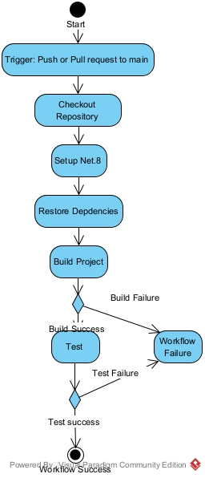

Workflow for deployment for Azure:
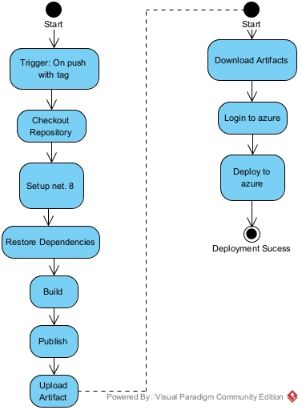

Workflow for making new releases:
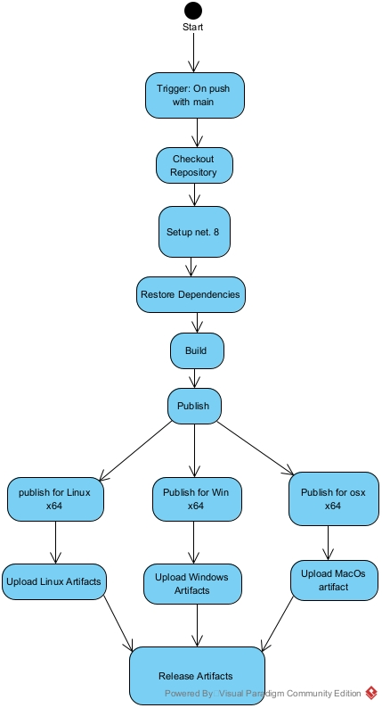

## Team work
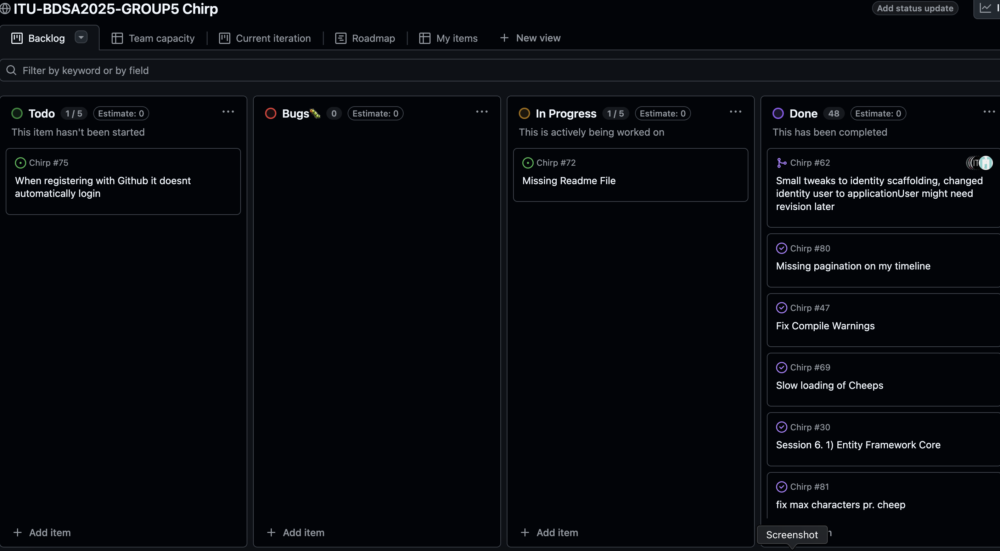
As of handing in our program, we still have a few unsolved issues. In our case we haven't solved the new feature of automatically logging a user in when they've registered with Github, and are still working on our ReadMe. These are not mandatory features, but shows that you can keep on polishing this project forever, with more and more new features.

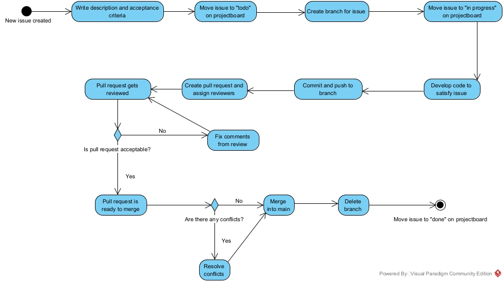
This is a illustration which briefly shows the flow of an issue being created to the feature being merged into main.

## How to make _Chirp!_ work locally

Install [.NET 8.0 SDK](https://dotnet.microsoft.com/en-us/download/dotnet/8.0) (if not already installed)

Clone the repository:  
From a terminal run:
<pre>
git clone https://github.com/ITU-BDSA2025-GROUP5/Chirp.git 
cd Chirp
</pre>

To make sure dependencies are installed  
In Chirp folder run:
<pre>dotnet restore</pre>

Configure user-secrets for OAuth Github:
<pre>
cd src\Chirp.Web
dotnet user-secrets set "Authentication:GitHub:ClientId" "Ov23li69eign4jFgBjYv" 
dotnet user-secrets set "Authentication:GitHub:ClientSecret" "5627aad084cd9a29aeb79c5339cc6a8d9db22c6e"
</pre>

If your still in the Chirp.Web folder, start the application with:
<pre>
dotnet run
</pre>

or you can start the application from root folder Chirp:
<pre>dotnet run --project .\src\Chirp.Web\</pre>

Open a browser and go to:
<pre>http://localhost:7103</pre>
Now you should be at the public timeline for Chirp!

## How to run test suite locally
Install [Powershell](https://learn.microsoft.com/en-us/powershell/scripting/install/install-powershell?view=powershell-7.5) (if not already installed)

Before we can run all the test we need to install Playwright  
Go to the Test and then the PlayWrightTests folder:
<pre>
cd Test/PlayWrightTests
</pre>

Install PlayWright:
<pre>pwsh bin/Debug/net8.0/playwright.ps1 install</pre>
You will need to have 'Powershell' to run this command

Go back into the Test folder
<pre>cd..</pre>

To run all tests:
<pre>dotnet test</pre>

<Strong>Test coverage:</Strong>
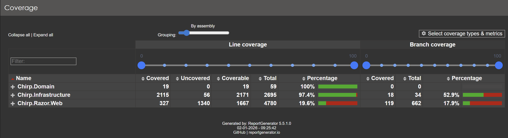

In our unit tests and integration tests, we focus on testing core methods, ensuring functionality, and using the Act–Assert pattern for readability.

We used PlayWright for making end-to-end and UI tests. The reason Chirp.Web has low test coverage, it's because of all of the scaffoled files.

# Ethics

## License
We have chosen the MIT license, which is a commonly used license. The MIT license is a permissive license, which provides more freedom, if there were other who wanted to reuse the software. 
This includes:
- Commercial use
- Modification
- Distribution
- Private use

We chose a permissive license over a copyleft license, since we are developing our project for educational purposes. Since the project doesn't contain any business-critical logic, we don't need to enforce strict ownership.

## LLMs, ChatGPT, CoPilot, and others
LLMs was used assisting the development of our project. 
The LLMs that was used was:
- ChatGPT
- CoPilot
- Gemini

LLM's was used for:
- Explain and understand ASP.NET core concepts besides the Microsoft documentation.
- Some error messages was fed to LLM's to help identify errors.
- Write HTML/CSS for the UI.
- Assisting in writing of workflows
- Assisting in phrasing of documentation
- Helping build the WebApplicationFactory for Playwrightests

The responses were genuinely helpful in understanding the ASP.NET core, writing HTML for UI and assisting with workflow.
LLM's responses regarding errors, can be very helpful to identify the problem, but you have to be careful when looking at its solutions. In our experience, it’s far more reliable to trace through the code yourself and use the LLM’s error analysis as a hint rather than a prescription. Blindly following its solutions can lead into a spiral of new errors.

Overall we like to believe that the use of LLM's has helped the development of the project. That said, as mentioned above, we have experienced that you should not blindly follow LLM's solutions, because you can end up in a spiral of new errors and issues. Instead, we experienced, that we benefited more from tracing through the code yourself, or using pen and paper to make it clear for you, how to solve the error.

## Appendix
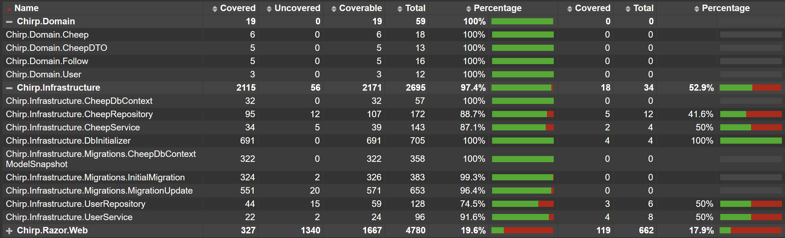
